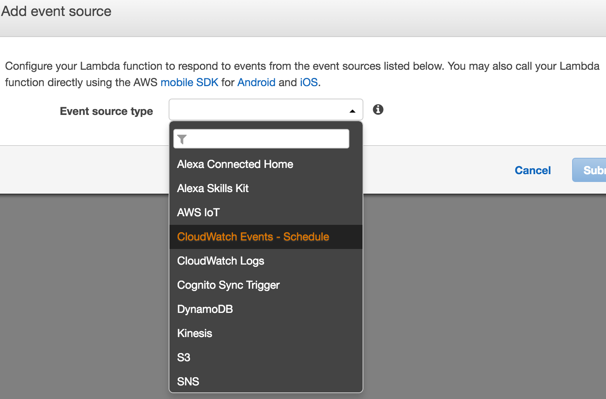
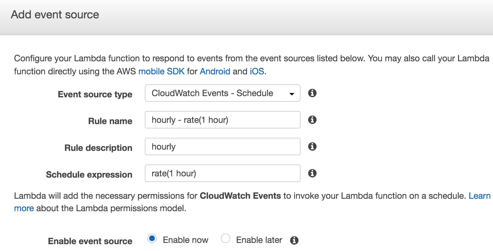

# soiqbot
A Python based Twitter bot which posts recently active questions from Stack Overflow on an hourly schedule.  Tweaked to run on AWS Lambda. 
Running Example: https://twitter.com/soiqbot

Prerequisites:
--------------
Twitter API key and <a href="http://stackapps.com/apps/oauth/register">StackExchange API key</a>

Lambda Setup Notes:
-------------------
The way Lambda works requires you to include any library dependencies. In this case after you add your keys to soiq_keys.py you would just zip everything for uploading.  For other projects you would need to install them locally like: `pip install module-name -t /path/to/project-dir`

In your AWS console under Lambda, click "Create Lambda Function" and skip the blueprint. Then upload the zip file.
The handler is based on the name of your main file + the name of the handler function (which is what Lambda uses to run.)

Our main file is soiq.py and the function name I used is just "handler" so it becomes: soiq.handler  

Finally, click "Add event source", go to "CloudWatch Events - Schedule" and set your schedule for it to run there.  

Lambda Docs:
http://aws.amazon.com/documentation/lambda

Lambda Pricing (FREE-ish):
https://aws.amazon.com/lambda/pricing/

